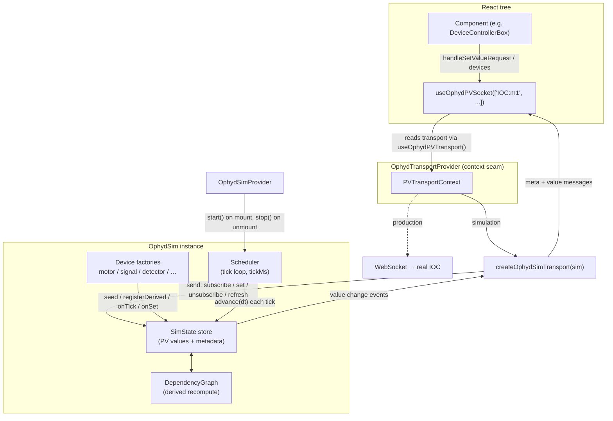

# ophyd-sim

A self-contained, browser-side simulator for [Ophyd](https://blueskyproject.io/ophyd/)
beamline devices. It models EPICS-style PVs — motors, shutters, detectors, and
derived signals — entirely in-process, so finch's normal Ophyd socket hooks can
be driven without a real IOC or WebSocket backend. It powers Storybook stories,
tests, and the [`SimulatedBeamline`](../../features/SimulatedBeamline/SimulatedBeamline.tsx)
widget.

Everything is re-exported from the package root ([index.ts](index.ts)); import
from `@/lib/ophyd-sim`, never from subfolders.

> This README is the usage / getting-started guide. For the architecture and the
> internals of the store, scheduler, and dependency graph, see
> [skills.md](skills.md).

---

## Table of contents

1. [Getting started](#getting-started) — minimal sim + providers + one `DeviceControllerBox`
2. [Device catalog](#device-catalog) — instantiating every device type
3. [Creating connected devices](#creating-connected-devices) — one device driven by another
4. [How ophyd-sim works](#how-ophyd-sim-works) — architecture diagram
5. [When & how ophyd-sim kicks in](#when--how-ophyd-sim-kicks-in) — the transport seam and the hooks that use it

---

## Getting started

The bare minimum: build a sim, wrap the tree in the two providers, and render a
single [`DeviceControllerBox`](../../components/DeviceControllerBox.tsx) wired to
a simulated motor. Because `DeviceControllerBox` is a plain presentational
component, you connect it to the sim through the ordinary
[`useOphydPVSocket`](../../api/ophyd/useOphydPVSocket.tsx) hook — the exact same
hook used against a real IOC.

```tsx
import { useMemo } from 'react';
import {
    OphydSimProvider,
    createOphydSimTransport,
    createOphydSim,
    motor,
} from '@/lib/ophyd-sim';
import { OphydTransportProvider } from '@/api/ophyd/OphydTransportProvider';
import useOphydPVSocket from '@/api/ophyd/useOphydPVSocket';
import DeviceControllerBox from '@/components/DeviceControllerBox';

// 1. Build a sim. Keep it stable across renders (module scope or useMemo).
const sim = createOphydSim({
    devices: [motor({ name: 'IOC:m1', limits: [-10, 10], velocity: 2, units: 'mm' })],
});

// 2. A leaf that talks to the sim through the normal Ophyd PV hook.
function MotorControl() {
    const { devices, handleSetValueRequest, toggleDeviceLock } = useOphydPVSocket([
        'IOC:m1',
        'IOC:m1.RBV',
    ]);

    return (
        <DeviceControllerBox
            device={devices['IOC:m1']}
            deviceRBV={devices['IOC:m1.RBV']}
            handleSetValueRequest={handleSetValueRequest}
            handleLockClick={toggleDeviceLock}
        />
    );
}

// 3. Wrap the tree: OphydSimProvider starts/stops the tick loop;
//    OphydTransportProvider routes the PV hooks at the sim instead of a WebSocket.
export function Example() {
    const transport = useMemo(() => createOphydSimTransport(sim), []);
    return (
        <OphydSimProvider sim={sim}>
            <OphydTransportProvider transport={transport}>
                <MotorControl />
            </OphydTransportProvider>
        </OphydSimProvider>
    );
}
```

Moving the motor from the box animates `IOC:m1.RBV` toward the setpoint and the
readback ticks live — no backend involved.

**In Storybook**, skip the boilerplate with the `withOphydSim` decorator, which
mounts both providers for you:

```tsx
import { withOphydSim, defaultBeamline } from '@/lib/ophyd-sim';

export const decorators = [withOphydSim(defaultBeamline)];
```

---

## Device catalog

Every device is a **factory** you drop into the `devices` array of
`createOphydSim`. Below is a comprehensive example of each supported type.

### Signal

A scalar PV. It can be a static literal, a periodically-recomputed function, a
value derived from other PVs, or any combination. Signals are **read-only by
default** — pass `writeAccess: true` to make them writable.

```ts
import { createOphydSim, signal, randomNoise } from '@/lib/ophyd-sim';

createOphydSim({
    devices: [
        // Static, read-only scalar.
        signal({ name: 'IOC:temperature', initialValue: 21.5, units: 'C' }),

        // Writable enum (In / Out), used as a control input for other devices.
        signal({
            name: 'IOC:bs',
            initialValue: 0,
            writeAccess: true,
            enumStrs: ['Out', 'In'],
        }),

        // Periodic signal: recomputes every 100 ms with fresh noise.
        signal({
            name: 'IOC:pressure',
            units: 'mbar',
            periodMs: 100,
            value: ({ random }) => 1000 + randomNoise({ random, sigma: 3 }),
        }),
    ],
});
```

Key `SignalOptions`: `initialValue`, `value` (literal or `(ctx) => value`),
`dependsOn`, `periodMs`, `units`, `limits`, `writeAccess`, `precision`,
`enumStrs`. (See [signal.ts](devices/signal.ts).)

### Motor

A linear-velocity motor. One factory seeds **three PVs** that share a single
motion state:

| PV | Meaning |
| --- | --- |
| `name` | setpoint (writable; clamps into `limits`) |
| `name.RBV` | readback — animates toward the setpoint at `velocity` units/s |
| `name.MOVN` | moving flag — `1` while moving, `0` once settled |

```ts
import { createOphydSim, motor } from '@/lib/ophyd-sim';

createOphydSim({
    devices: [
        motor({
            name: 'IOC:m1',
            initialPosition: 0,
            velocity: 2, // units per second
            limits: [-10, 10], // soft limits clamp setpoint writes
            units: 'mm',
            // epsilon: 1e-4,          // settle tolerance (optional)
            // readbackName: 'IOC:m1.RBV',  // override defaults (optional)
            // movingName: 'IOC:m1.MOVN',
        }),
    ],
});
```

Writing the setpoint (`sim.set('IOC:m1', 5)`) sets `MOVN=1` and advances `.RBV`
by `velocity * dt` each tick until it lands within `epsilon`, then snaps and
clears `MOVN`. (See [motor.ts](devices/motor.ts).)

### Detector

A simulated area detector. Unlike single-value devices, a detector seeds a
**cluster** of standard Area-Detector PVs from one `prefix` — `cam1:SizeX`,
`cam1:SizeY`, `cam1:MinX`, `cam1:MinY`, `cam1:ColorMode`, `cam1:DataType`,
`cam1:Acquire`, and the image `image1:Mode`. The image pixels themselves are not
a PV; they stream over the [camera socket](#the-camera-socket) — but their scalar
parameters (opacity, overlay positions) are PVs that other devices can drive.

```ts
import { createOphydSim, detector } from '@/lib/ophyd-sim';

createOphydSim({
    devices: [
        detector({
            prefix: '13SIM1',
            image: {
                mode: 'image_file', // or 'noisy' for random-noise frames
                sizeX: 1024,
                sizeY: 1024,
                file: '/images/diffraction.png',
                // files: ['/f0.png', '/f1.png'],  // round-robin per frame (optional)
                overlays: [
                    {
                        file: '/images/beamstop-dot.png',
                        width: 32,
                        height: 32,
                        x: 512, // center in pixels (fallback if unbound)
                        y: 512,
                    },
                ],
            },
            // Derived image parameters other devices drive — see next section.
            modulations: [],
        }),
    ],
});
```

Detectors are usually loaded from JSON — see
[simDetector.json](scenarios/simDetector.json) and `simDetectorConfig`. To render
frames to a canvas, pair the detector with
`createSimDetectorCameraSocketFactory` (see [The camera socket](#the-camera-socket)).
(See [detector.ts](devices/detector.ts).)

### Bonus: shutter & hexapod

Two higher-level factories cover common beamline hardware:

```ts
import { createOphydSim, shutter, hexapod } from '@/lib/ophyd-sim';

createOphydSim({
    devices: [
        // Beam shutter: one analog-output PV, 0 V open / 5 V closed. Defaults open.
        shutter({ name: 'bl531:LJT4:1:AO0' /*, initial: 'closed' */ }),

        // Symetrie six-axis hexapod: seeds *_RBV readbacks, MOVE_PTP setpoints,
        // and the MOVE_PTP execute/STOP command PVs under the given prefix.
        hexapod({ prefix: 'SYM:HEX01', translationVelocity: 4, rotationVelocity: 2 }),
    ],
});
```

See [shutter.ts](devices/shutter.ts) and [hexapod.ts](devices/hexapod.ts) for
the full PV maps and options.

---

## Creating connected devices

The whole point of the simulator is that one device can react to the **current
value of another**. Devices never reference each other directly — they read and
write the same shared state. A device becomes "connected" by listing the PVs it
cares about in `dependsOn`; its `compute` function then re-runs, in dependency
order, whenever any of those inputs change.

Inside `compute(ctx)` you get a `SimValueContext`:

- `ctx.get.number(pv)` / `.boolean(pv)` / `.string(pv)` / `.value(pv)` — read inputs
- `ctx.time`, `ctx.dt` — current time (ms) and elapsed seconds since last tick
- `ctx.random()` — the sim's random source (override `random` in `createOphydSim`
  for deterministic tests)

> `compute` also runs **once at registration** to seed an initial value, so guard
> against inputs that may not be seeded yet. Order matters: a dependency must be
> registered *before* the device that depends on it. A `compute` that throws is
> logged and skipped, not fatal.

### Example 1 — a signal derived from a motor and a control input

A diode reading that peaks when a motor's readback is near 2, is attenuated when
a beamstop is inserted, and carries measurement noise:

```ts
import { createOphydSim, motor, signal, gaussian, randomNoise } from '@/lib/ophyd-sim';

createOphydSim({
    devices: [
        motor({ name: 'IOC:m1', limits: [-10, 10], velocity: 1, units: 'mm' }),
        signal({ name: 'IOC:bs', initialValue: 0, writeAccess: true, enumStrs: ['Out', 'In'] }),

        // I0 recomputes whenever the motor readback OR the beamstop changes,
        // and also every 100 ms so the noise keeps moving.
        signal({
            name: 'I0',
            units: 'arb.',
            periodMs: 100,
            dependsOn: ['IOC:m1.RBV', 'IOC:bs'], // <-- the connection
            value: ({ get, random }) => {
                const beam = 1000 * gaussian({ x: get.number('IOC:m1.RBV'), center: 2, sigma: 0.5 });
                const attenuated = get.boolean('IOC:bs') ? beam * 0.01 : beam;
                return attenuated + randomNoise({ random, sigma: 5 });
            },
        }),
    ],
});
```

Now `sim.set('IOC:m1', 2)` makes `I0` climb as the readback approaches the peak,
and `sim.set('IOC:bs', 1)` drops it ~99% — all automatically. This is exactly the
[`defaultBeamline`](scenarios/defaultBeamline.ts) scenario.

### Example 2 — chaining multiple derived signals

`dependsOn` targets can themselves be derived PVs, so you can build a coupling
chain. Here energy drives a Bragg angle, which drives a beam position:

```ts
import { createOphydSim, motor, signal, braggAngle } from '@/lib/ophyd-sim';

createOphydSim({
    devices: [
        motor({ name: 'bl:mono_energy_eV', limits: [2000, 7000], velocity: 100, initialPosition: 4500 }),

        // θ derived from energy.
        signal({
            name: 'bl:bragg_deg',
            units: 'deg',
            dependsOn: ['bl:mono_energy_eV.RBV'],
            value: ({ get }) => braggAngle({ energyEV: get.number('bl:mono_energy_eV.RBV') }),
        }),

        // beam Y derived from θ — a second-order dependency.
        signal({
            name: 'bl:beam_y_mm',
            units: 'mm',
            dependsOn: ['bl:bragg_deg'],
            value: ({ get }) => 4 * Math.cos((get.number('bl:bragg_deg') * Math.PI) / 180),
        }),
    ],
});
```

### Example 3 — a detector image driven by another device

A detector `modulation` is just a derived PV under the hood: it binds an image
parameter (e.g. `image1:Opacity`) to a source PV via a linear-clamped map. Here
beam energy dims the rendered image, and a beamstop motor's readback drives an
overlay marker's position:

```ts
detector({
    prefix: '13SIM1',
    image: {
        mode: 'image_file',
        sizeX: 1024,
        sizeY: 1024,
        file: '/images/diffraction.png',
        overlays: [
            {
                file: '/images/beamstop-dot.png',
                width: 32,
                height: 32,
                x: 512,
                y: 512,
                // Bind the marker's X to a motor readback: -10..10 mm -> 0..1024 px.
                positionX: {
                    source: 'bl531_xps2:beamstop_x_mm.RBV',
                    from: { in: -10, out: 0 },
                    to: { in: 10, out: 1024 },
                },
            },
        ],
    },
    // Energy 2000..7000 eV maps to image opacity 1.0..0.2.
    modulations: [
        {
            source: 'bl:mono_energy_eV.RBV',
            effect: 'opacity',
            from: { in: 2000, out: 1.0 },
            to: { in: 7000, out: 0.2 },
        },
    ],
});
```

The flagship [`beamstopBeamline`](scenarios/beamstopBeamline.ts) scenario wires
all of these patterns together (energy → Bragg → beam Y → 2D-Gaussian diode
current, gated by a shutter). It's worth reading as a full worked example — the
physics is documented in [skills.md](skills.md#beamstopbeamline).

---

## How ophyd-sim works

A sim is a bag of named PVs over shared state, plus two update mechanisms:

- **Ticks** — a periodic loop (`tickMs`, ~33 ms ≈ 30 Hz) that advances time-based
  devices: motor motion, periodic signals.
- **Derived signals** — values with a `dependsOn` list that recompute, in
  dependency order, whenever an input PV changes.

The React app never talks to the sim directly. It uses its ordinary Ophyd PV
hooks, which read a **transport** from context. In production that transport is a
WebSocket to a real IOC; `createOphydSimTransport` swaps in an implementation of
the same interface that reads and writes the in-memory sim instead.



The two providers have distinct jobs:

- **`OphydSimProvider`** owns the sim's lifecycle — it calls `sim.start()` on
  mount and `sim.stop()` on unmount, and exposes the sim to the sim-specific
  hooks (`useSimSignal`, `useSimSet`).
- **`OphydTransportProvider`** installs the transport into context so the
  *generic* Ophyd hooks resolve to the sim instead of a WebSocket. (It can also
  wrap the sim with `fallbackToReal` so descendants fail over to a real backend
  if the override reports an error.)

---

## When & how ophyd-sim kicks in

ophyd-sim engages purely through the **transport seam**. finch's Ophyd hooks
never open a socket themselves — they pull a transport out of React context via
`useOphydPVTransport()`. Whichever transport is in context wins:

- **No `OphydTransportProvider`, or no override** → the hook lazily constructs a
  real WebSocket transport pointed at the configured backend. (Production.)
- **An `OphydTransportProvider` supplies `transport={createOphydSimTransport(sim)}`**
  → every descendant PV hook is transparently driven by the sim. Nothing else in
  the component changes; the same code runs against sim or IOC. (Storybook, tests,
  `SimulatedBeamline`.)

### What the sim transport speaks

`createOphydSimTransport` implements the `OphydPVTransport` wire protocol. The
hooks exercise it through these actions ([createOphydSimTransport.ts](transport/createOphydSimTransport.ts)):

| Action sent by a hook | What the sim transport does |
| --- | --- |
| `subscribe` / `subscribeSafely` / `subscribeReadOnly` | Emits a synthesized `meta` message (so the device shows connected) then streams every value change for that PV |
| `set` | Writes to the sim (`sim.set`), triggering derived recompute + motor motion |
| `unsubscribe` | Drops the most recent listener for that PV |
| `refresh` | Replays the latest value of every active subscription |
| `onStatus` | Reports `'open'` synchronously — there's no real handshake |

### The Ophyd hooks that use the transport

These are the specific hooks that resolve their transport from context and are
therefore driven by ophyd-sim when a sim transport is provided:

- **[`useOphydPVSocket(pvs, wsUrl?)`](../../api/ophyd/useOphydPVSocket.tsx)** — the
  primary PV-socket hook. Reads its transport via `useOphydPVTransport()`, sends
  `subscribe`/`set`/`unsubscribe`/`refresh`, and returns `{ devices,
  handleSetValueRequest, toggleDeviceLock, toggleExpand }`. **This is the hook the
  sim is built to serve.**
- **[`useOphydSocket(pvs, wsUrl?)`](../../api/ophyd/useOphydSocket.ts)** — legacy
  alias kept for backwards compatibility; delegates to `useOphydPVSocket`, so it
  is sim-driven too.

The React-native sim hooks in [`react/`](react/) talk to the sim **directly**
(not through the transport), and are handy when you're already inside an
`OphydSimProvider` and don't need the full PV-socket abstraction:

- **`useSimSignal(pv)`** — subscribe to one PV's value; re-renders on change.
- **`useSimSet()`** — returns a stable `(pv, value) => void` writer.
- **`useOphydSim()` / `useOphydSimOptional()`** — grab the sim instance itself.

### The camera socket

Detector **image frames** don't travel over the PV transport — they stream over a
separate camera-socket seam. `CameraCanvas` reads its factory from
`useCameraSocketFactory()`, which `OphydTransportProvider` supplies via its
`cameraSocketFactory` prop. Pass
`createSimDetectorCameraSocketFactory(sim, detectorConfig)` there to render a
detector's live derived state (opacity, overlay positions) to canvas frames — see
[`SimulatedBeamline`](../../features/SimulatedBeamline/SimulatedBeamline.tsx) for
the full wiring.

### Not backed by ophyd-sim

- **[`useOphydDeviceSocket`](../../api/ophyd/useOphydDeviceSocket.ts)** uses the
  separate *device*-socket transport. `createOphydSimTransport` is a *PV*
  transport only, so this hook is not driven by ophyd-sim (it falls back to the
  real device backend unless you supply a `deviceTransport` override).
- **[`useSimOphydPVSocket`](../../api/ophyd/useSimOphydPVSocket.tsx)** is an older,
  standalone mock (`sineSignal` / `noisySignal` keywords) that is **unrelated** to
  this package — it doesn't use a transport at all. Prefer `useOphydPVSocket` +
  a sim transport for new work.

### Driving the sim without React

The transport and providers are optional. You can drive a sim directly — useful
in tests, where you skip the real loop and step time by hand:

```ts
const sim = createOphydSim({ devices: [motor({ name: 'IOC:m1', velocity: 2 })] });

sim.set('IOC:m1', 5); // command a move
sim.advance(1000); // step 1 s of simulated time (no real timers)
sim.get('IOC:m1.RBV'); // => 2  (moved velocity * dt)

// or run the real loop:
sim.start();
// ... later ...
sim.stop();
```

`advance(deltaMs)` runs a single synthetic tick, so motor motion and periodic
recompute are fully deterministic when you also override `random` and `now` in
`createOphydSim`.
